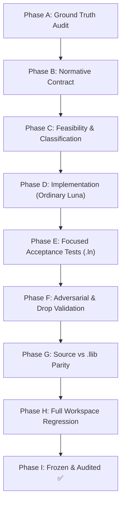

# Luna Standard Library Design Protocol (luna-stdlib-design)

## Purpose

This skill is the **canonical architectural authority** for all design, implementation, refactoring, and evolution of Luna's standard library (`libs/external`, `sysroot`, public `std::*` APIs, collections, I/O, formatting, and runtime bindings).

The primary hazard this skill eliminates is **foreign-language drift**:
- "Rust has module `io` $\implies$ Luna gets module `io`"
- "Rust has `Entry` $\implies$ Luna gets `Entry`"
- "Rust has `From` / `Into` $\implies$ Luna gets `From` / `Into`"
- "Rust has `process::args()` $\implies$ Luna adopts `process::args()`"
- "C++ has `std::iostream` $\implies$ Luna adopts stream state"

Such drift violates Luna's own architecture, semantics, compiler capability, and frozen specifications.

> ### The Luna Stdlib Maxim
> **Design Luna stdlib from Luna semantics outward, not by translating Rust/C++ APIs inward.**

---

## 1. Core Philosophy (Frozen Principles)

### 1.1 Stdlib is a Language Client
The standard library is an ordinary consumer of the Luna programming language. It does **not** define hidden compiler semantics.

- **No Compiler Special-Casing**: The compiler must never acquire type-specific branches, opcodes, or AST magic for `Vec`, `String`, `Box`, `HashMap`, `HashSet`, `Option`, or `Result`.
- **General Compiler Defect Protocol**: If implementing a stdlib feature exposes a general compiler limitation or bug:
  $$\text{stdlib implementation} \longrightarrow \text{minimal standalone .ln reproducer} \longrightarrow \text{classify C-GAP-*} \longrightarrow \text{generic compiler repair} \longrightarrow \text{permanent regression} \longrightarrow \text{resume stdlib}$$
- Never modify compiler semantics merely to make one stdlib API compile.

### 1.2 Provider Identity $\neq$ Physical Path $\neq$ Logical Namespace
This is a permanent, non-negotiable Luna invariant:
- **Physical Providers** (`lang/option.ln`, `alloc/vec.ln`, `alloc/string.ln`, `io/io.ln`, etc.) and **Artifacts** (`option.llib`, `vec.llib`, `io.llib`, etc.) exist solely for discovery, loading, dependency management, and compilation unit boundaries.
- **Providers DO NOT dictate the public logical namespace.**
- Multiple physical providers contribute directly to the single unified public namespace:
  ```luna
  module std {
      export struct Vec<T> { ... }
  }
  ```
- **Correct Usage**:
  - `std::Vec<T>`
  - `std::String`
  - `std::println(...)`
  - `std::read(...)`
- **Forbidden Usage** (unless explicitly mandated by a frozen specification):
  - `io::read(...)`
  - `alloc::Vec`
  - `vec::Vec`
  - `process::args(...)`
- **Never infer a public namespace from a filename, directory, or provider name.**

### 1.3 Compiler / Runtime / Stdlib Boundary
Maintain three strictly isolated responsibilities:

```text
       ┌─────────────────────────────────────────────────────────┐
       │                        COMPILER                         │
       │ Language semantics, typechecker, borrowck, regions,     │
       │ generics, traits, AST/MVIR/LLVM lowering, entrypoint    │
       └────────────────────────────┬────────────────────────────┘
                                    │ (lowering)
                                    ▼
       ┌─────────────────────────────────────────────────────────┐
       │                     STANDARD LIBRARY                    │
       │ Safe, high-level policy, Vec/String/Result wrappers,    │
       │ UTF-8 validation, IoError translation, algorithms       │
       └────────────────────────────┬────────────────────────────┘
                                    │ (calls internal ABI)
                                    ▼
       ┌─────────────────────────────────────────────────────────┐
       │                       RUNTIME                           │
       │ Low-level platform mechanism, OS/CRT interaction,       │
       │ allocation primitives, raw I/O, stable __luna_* ABI     │
       │ (ZERO knowledge of Vec, String, Result, or HashMap)     │
       └─────────────────────────────────────────────────────────┘
```

- **Stdlib Over Runtime Expansion**: If a capability can safely and reasonably be implemented in ordinary Luna source code, **prefer stdlib implementation over runtime expansion**.
- The runtime must remain a minimal C execution substrate; it must never become a convenience library.

### 1.4 Public API $\neq$ Implementation Mechanism
Never freeze implementation details as public language or library semantics:
- `copy_from_slice`: The semantic contract is *elementwise copy between equal-length slices of `Copy` elements*; it is **not** "must lower to `memcpy`".
- `sort`: The semantic contract is *in-place, unstable, worst-case $O(n \log n)$, $O(\log n)$ auxiliary space, ownership-sound*; introsort is an implementation detail.
- `float` math: Semantic IEEE 754 behavior belongs to Luna; `libm` vs LLVM intrinsics is an implementation detail.
- Generic monomorphization deduplication: Semantic invariant is *identical instantiated definitions must not trigger duplicate symbol errors*; Windows COFF COMDAT (`IMAGE_COMDAT_SELECT_ANY` + `LinkOnceODR`) is an object/linkage mechanism.
- Always explicitly distinguish **Normative Contract** from **Implementation Strategy**.

### 1.5 Source / .llib Parity
Every public stdlib capability must behave identically whether consumed from:
1. `.ln` source files, or
2. `.llib` canonical binary artifacts.

Provider identity, exported symbols, impl headers, trait method resolution, generic bounds, and semantic metadata must survive `.llib` serialization and deserialization. Never accept "works from source, fails from `.llib`" as a complete implementation.

### 1.6 No Foreign-Language API Copying
Rust, C++, Swift, and Go are **empirical capability checklists**, not API specifications for Luna.
Before adopting any foreign API pattern, the agent must evaluate:
1. What problem does this solve?
2. Is that problem present in Luna?
3. Can Luna express this abstraction soundly under current language rules?
4. Does Luna have different ownership, borrow, or lifetime constraints?
5. Is there already an idiomatic Luna-native abstraction?
6. Would the proposed API create future compatibility or borrowck debt?

**Precedents Already Frozen**:
- *Rust `HashMap::entry`*: Blocked by `LANGUAGE-GAP-05` (borrow-carrying aggregate lifetime parameterization); Luna uses sound direct methods (`get_or_insert`, `insert_if_absent`).
- *Rust lazy borrowed `HashSet` algebra*: Blocked by lack of lending iterators (`LANGUAGE-GAP-04`); Luna uses owned set algebra (`union_owned`) for v1.
- *Rust `From` / `Into`*: Luna uses explicit `Convert<T>` and `TryConvert<T>` trait protocols.
- *Rust `std::process::*`*: Luna has no public `process` namespace; CLI arguments are delivered exclusively via `fn main(args: [str]) -> i32`.

---

## 2. Luna Type & Ownership Ground Truths

### 2.1 String & Byte Types
- **`str`**: Static, NUL-terminated byte pointer model (`*const u8`). Passed by value. It is **not** a general borrowed UTF-8 slice.
- **`String`**: Owned `Vec<u8>` container. **MUST always maintain valid UTF-8**.
- **`Vec<u8>` / `[u8]`**: Arbitrary bytes. Carries **no** UTF-8 invariant.

#### The Safe UTF-8 Boundary Rule
```text
Safe byte APIs may accept arbitrary bytes ([u8]).
String-producing or String-accepting APIs MUST validate UTF-8.
```
- Safe APIs must **never** assume "the caller promises UTF-8" unless the input already carries a type-level UTF-8 invariant (e.g. `&String` or `str`).
- `Writer::write_utf8(bytes: &[u8])`: Must validate UTF-8 before appending to internal storage, returning `Err(FmtError::InvalidUtf8)` on failure.

### 2.2 Borrow & Region Invariants
Stdlib designs must honor the 4 Fundamental Region Invariants:
1. **Place Identity $\neq$ Loan Liveness**
2. **Value Provenance $\neq$ Type Syntax**
3. **Static Place $\neq$ Dynamic Lifetime Instance**
4. **Region Validity $\neq$ Borrow Legality**

- **`life_from(...)`**: Proves that a returned reference or struct cannot outlive the referent. **It does NOT prove mutable exclusivity.** Exclusivity is governed strictly by borrowck loan states.
- **Unsafe Boundaries Require Explicit Soundness Proofs**: When implementing a safe API using internal `unsafe` (e.g. `split_at_mut`), the agent must document and prove:
  - Valid preconditions (e.g. $mid \le len$).
  - Disjointness (e.g. $left \cap right = \emptyset$).
  - In-bounds pointer arithmetic within allocation bounds.
  - Returned lifetimes bounded by input lifetime ($life(out) \le life(src)$).
  - Source mutable capability cannot be accessed while derived borrows exist.
- *Passing unit tests is empirical evidence; it is NOT a substitute for mathematical proof obligations.*

---

## 3. Public Stdlib Namespace & Export Rules

When designing or modifying standard library APIs:
1. **Determine the physical provider** (e.g. `libs/external/alloc/vec.ln`).
2. **Determine dependencies** (strictly forward; no circular imports; `core` never imports `alloc`).
3. **Determine the logical namespace from canonical specifications** (almost universally `module std`).
4. **DO NOT derive namespaces from provider filenames.**

### Universal `std` Convention
Unless a frozen specification explicitly decrees a distinct namespace, standard library providers contribute to `module std`:
```luna
module std {
    export struct Vec<T> { ... }
    export struct String { ... }
    export fn println(msg: str) -> void { ... }
    export fn read(path: str) -> Result<Vec<u8>, IoError> { ... }
}
```

### Anti-Duplication Rule
Do not expose multiple redundant aliases for the same function (e.g. exposing both `std::io::read` and `std::io_read` or `std::read`). Aliases introduce maintenance debt and require explicit justification in a frozen design document.

---

## 4. Entrypoint & Process Argument Architecture

### Canonical Main Signatures
The compiler recognizes and validates exactly three entrypoint forms:
```luna
fn main() -> void
fn main() -> i32
fn main(args: [str]) -> i32
```

### Process Argument Architecture (C-GAP-11 Frozen Invariants)

#### 4.1 Source-Language Entry Contract — Frozen ✅
- **Sole Delivery Mechanism**: `fn main(args: [str]) -> i32` is the sole language-level mechanism for receiving command-line user arguments.
- **User Arguments Only**: `args` strictly contains user-supplied arguments; the native executable name (`argv[0]`) is excluded.
- **Vector Preservation**: Argument count and exact launcher ordering are preserved.
- **Duration Validity**: Arguments remain valid for the complete duration of `main`.
- **No-Arg Main Variants Unchanged**: `fn main() -> void` and `fn main() -> i32` continue to be accepted with identical semantics.

#### 4.2 Public Stdlib Contract — Frozen ✅
- **Permanent Prohibition of Public `process::*`**: Luna exposes **NO** public `process::*` namespace (and no duplicate aliases such as `env::args`, `sys::args`, or `runtime::args`).
- **No Resurrecting Process Provider**: Agents are strictly forbidden from creating `process.ln` or re-introducing any public process API surface in any future stdlib phase. Process startup and argument acquisition are runtime and compiler concerns, not standard library abstractions.

#### 4.3 Runtime / Platform Contract — Frozen ✅
- **Storage Backing Invariant**: Every runtime argument returned for main delivery must reference valid process-lifetime NUL-terminated storage.
- **Windows Platform Normalization**: The Windows runtime startup normalizes native UTF-16 command lines into UTF-8 `argv`.
- **POSIX Platform Normalization**: POSIX platforms deliver native process-lifetime NUL-terminated `argv` bytes.
- **`str` vs `String` Separation**: Luna `str` is a NUL-terminated byte pointer; strict UTF-8 validity is an invariant of `String`, not conflated with `str`.

#### 4.4 Current Implementation Strategy — Non-normative, Verified ✅
- **Stack Alloca Strategy**: The current backend entry adapter dynamically stack-allocates an array of `str` pointers via `alloca` in `@__luna_start` and bridges via `__luna_process_arg(i, &ptr, &len)`. This is an implementation mechanism; future runtime optimizations (e.g. providing a direct borrowed contiguous array view from runtime storage without stack rebuilding) or target-specific startup mechanisms may be adopted without altering language semantics.
- **Zero Heap Allocation**: An implementation guarantee for Runtime ABI v1 (no heap allocations performed merely to enter `main`), not an observable source-language semantic requirement.

---

## 5. Domain-Specific Design Rules

### 5.1 Collections & Ownership
- **Non-Copy Observable-Drop Testing**: For any generic container (`Vec<T>`, `HashMap<K, V>`, `HashSet<T>`, `Box<T>`), primitive-only tests (`i32`, `bool`) are **insufficient**. Any method that moves, shifts, replaces, or drops elements must be tested using a non-`Copy` type with observable drop tracking.
- **Linear Ownership Invariant**:
  $$\text{Every owned value has exactly one owner; every value requiring Drop is dropped exactly once.}$$
- When writing container mutations (`swap_remove`, `retain`, `dedup`, `resize`, `insert`, `remove`):
  - Track moved-out slots and replacements.
  - Guard against double-drop during partial moves or reassignments.
  - Account for panic/error unwinding and early returns.

### 5.2 Iterators & Generics
- **No Nominal Proliferation**: Do not create duplicate nominal types to bypass temporary compiler generic limitations.
  - **Correct**: `Range<T>` and `RangeInclusive<T>` with concrete integer implementations (`Range<i32>`, `Range<u64>`, etc.).
  - **Forbidden**: `RangeU8`, `RangeU16`, `RangeI32`, `RangeI64`.
- If generic trait implementation fails: isolate a minimal reproducer, register a `C-GAP-*`, and fix the compiler generically. Never mutilate the stdlib design to dodge a compiler bug.

### 5.3 Error Handling & The `?` Operator
- **`?` $\neq$ `Error`**: The `?` operator is desugared strictly via the `Try` and `FromResidual` language contracts (`core/try.ln`).
- The `?` operator does **not** require `E: Error`.
- `trait Error` is reserved for human-readable diagnostics and display formatting; it must never be hardwired into control-flow syntax.

### 5.4 Formatting & Display
- **Strict Layering**: `core/fmt` MUST NOT depend on `alloc`.
  - `core/fmt`: defines `trait Writer`, `trait Display`, `enum FmtError`.
  - `alloc/string`: implements `Writer for String` and depends on `core/fmt`.
- Formatting primitives must support writing into fixed buffers, raw slices, or custom writers without forcing heap allocations (`String`).

### 5.5 Numerics & Floats
- Luna supports primitive inherent methods directly.
- **Checked Operations**: Overflow detection must precede any operation that would trap or overflow at runtime.
- **Float Semantics**: Tracked under `C-GAP-09`. Do not attempt to emulate missing IEEE 754 compiler/backend operations with brittle stdlib workarounds.

### 5.6 FFI & Unsafe Boundaries
- `unsafe` blocks permit raw pointer dereferencing, external calls, and unchecked casts; **`unsafe` does NOT disable ownership, move semantics, borrow checking, or lifetime rules.**
- Safe public stdlib APIs backed by `unsafe` internals must be impenetrable: safe callers must never be able to trigger undefined behavior.
- Typed stdlib errors (e.g. `Result<T, IoError>`) must wrap raw runtime status codes; never expose runtime integer return codes to public Luna consumers.

---

## 6. Standard Library Design Workflow

Every standard library task must execute the following 8-phase progression:



### Phase A — Ground Truth Audit
Before writing code:
- Search existing frozen specifications (`docs/spec/`).
- Inspect sysroot manifest (`sysroot.toml`) and current provider layout.
- Check target public namespace (`module std`).
- Verify required language capabilities in the compiler.
- Do not infer semantics from Rust, C++, or external languages.

### Phase B — Normative Contract
Formulate the exact contract:
- Public types, function signatures, and method receivers (`&self`, `&rw self`, `self`).
- Ownership transitions and move semantics.
- Lifetime relationships (`life_from`).
- Error types and failure conditions.
- Algorithmic time and space complexity.
- Data validity rules (especially UTF-8).

### Phase C — Feasibility & Classification
Classify each item into one of the canonical dispositions:
- `IMPLEMENT`: Expressible in safe Luna.
- `SAFE-API-VIA-AUDITED-UNSAFE`: Requires audited internal unsafe boundary with documented proof obligations.
- `LANGUAGE-BLOCKED`: Requires a language feature not yet supported by Luna (register in `language-gap-registry.md`).
- `COMPILER-GAP`: Blocked by a bug in the existing compiler (register `C-GAP-*` and fix compiler first).
- `DEFERRED`: Intentionally postponed to a future milestone.

### Phase D — Implementation
- Implement purely in ordinary Luna.
- Do not touch compiler or runtime code during stdlib implementation.

### Phase E — Focused Acceptance Tests
- Write real, standalone `.ln` integration programs executed through the Luna CLI driver.

### Phase F — Adversarial & Drop Validation
- Test with non-Copy types tracking drops (`DropProbe`).
- Test empty inputs, single elements, boundary sizes ($0, 1, 2, 2^{31}-1$).
- Test aliasing boundaries, invalid UTF-8 byte sequences, integer limits (`MIN`, `MAX`).
- Verify deterministic abort or error handling on invalid branches.

### Phase G — Source vs .llib Parity
- Compile provider to `.llib` and `.obj`.
- Run identical consumer test suites against `.ln` source and `.llib` artifact.

### Phase H — Full Workspace Regression
- Run `cargo test` across all workspace crates and verify clean build.

---

## 7. Mandatory Preflight Protocol

Before writing or modifying any file in `libs/external/`, the agent **MUST** output an Architectural Preflight in the following exact format:

```text
======================= STDLIB ARCHITECTURAL PREFLIGHT =======================
Provider:                     <e.g. alloc/vec.ln>
Public Namespace:             <e.g. std (std::Vec)>
Dependencies:                 <e.g. lang/drop, core/ptr, core/mem>
Existing Frozen Contract:     <e.g. STD-ARCH-01, CORE-GAP-08, or none>
Required Language Machinery:  <e.g. generics, struct life_from, trait impl>
Ownership & Lifetime Risks:   <e.g. realloc move safety, double-drop on panic>
Unsafe Boundary & Proofs:     <e.g. raw ptr offset within bounds; NONE>
Artifact Parity Impact:       <e.g. requires sysroot.toml update, .llib rebuild>
Compiler Changes Expected:    NO
=============================================================================
```

> [!CRITICAL]
> For standard library implementation tasks, `Compiler Changes Expected` must normally be **`NO`**.
> If during implementation it becomes **`YES`**, the agent must **immediately halt**, isolate a standalone `.ln` reproducer, register a `C-GAP-*` defect, fix the compiler generically, and only then return to stdlib work.

---

## 8. API Review Checklist

Before marking any stdlib API as complete or proposing it for review, verify:

| # | Check Item | Status |
|---|---|---|
| 1 | What physical provider owns this implementation? | Confirmed |
| 2 | What logical namespace exposes it (`module std`)? | Confirmed |
| 3 | Does provider identity accidentally leak into the public API? | No leaks |
| 4 | Is this Luna-native rather than a direct copy of Rust/C++? | Verified |
| 5 | Is there already a frozen specification for this domain? | Verified |
| 6 | Does it avoid requiring speculative compiler capabilities? | Verified |
| 7 | Does it guarantee every owned value is dropped exactly once? | Verified |
| 8 | Are generic operations tested with non-`Copy` observable-drop values? | Verified |
| 9 | Does it maintain complete source vs `.llib` parity? | Verified |
| 10 | If `unsafe` is used, are soundness proof obligations documented? | Verified |
| 11 | Does the `String` UTF-8 invariant remain strictly protected? | Verified |
| 12 | Is the runtime used strictly for low-level OS mechanism? | Verified |
| 13 | Is the public contract independent of backend lowering details? | Verified |
| 14 | Are empty, boundary, and error cases fully covered? | Verified |
| 15 | Does the workspace compile with zero warnings or errors? | Verified |

---

## 9. Architectural Smells & Anti-Patterns

If any of the following thoughts occur, **STOP immediately** — they are architectural smells:

| Anti-Pattern Smell | Why It Is Forbidden in Luna | Correct Luna Architecture |
|---|---|---|
| *"The file is `io.ln`, so create `module io`."* | Providers do not define namespaces. Physical file organization is an internal package/sysroot concern. | Contribute declarations to `module std` (`std::read`, `std::println`). |
| *"Rust has `Entry`, so let's add `Entry`."* | Borrow-carrying intermediate enums are blocked by `LANGUAGE-GAP-05`. | Use direct sound methods on the container (`get_or_insert`, `insert_if_absent`). |
| *"The compiler rejects this stdlib method; let's patch the typechecker to accept it."* | Stdlib is a client of the language. Compiler special-casing violates language invariants. | Determine if language-blocked or compiler bug. If bug, isolate reproducer and follow C-GAP protocol. |
| *"Tests pass with `i32`, so generic container ownership is verified."* | Primitives are `Copy` and never run destructors. Leaks and double-drops are invisible. | Always test with non-`Copy` types containing a `DropProbe`. |
| *"Let's implement this in C runtime because it is faster / easier."* | Runtime is for minimal OS/platform mechanism. Stdlib implements safe policy. | Implement algorithms and safe data structures in ordinary Luna source code. |
| *"Let's expose both `std::io::read` and `std::read` just in case."* | Duplicate aliases create documentation ambiguity and permanent maintenance debt. | Expose exactly one canonical, frozen public API. |
| *"Use `memcpy` because this is a copy operation."* | Blurs normative language contract with backend lowering. Violates non-`Copy` safety. | Semantic contract is elementwise copy of `Copy` elements. Backend lowers safely. |
| *"Let's create `RangeU8`, `RangeU16`, `RangeI32` to avoid generic trait bugs."* | Proliferates nominal types and creates permanent public API garbage. | Fix generic trait method resolution in compiler; keep canonical `Range<T>`. |
| *"It compiles from `.ln` source, so the task is complete."* | Binary artifacts (`.llib`) have distinct serialization, metadata, and linkage paths. | Must verify complete source vs `.llib` parity. |
