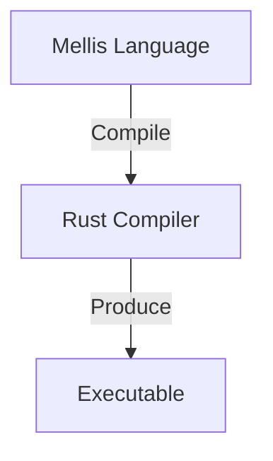

# Mellis Compiler Rewrite v2 — Rust Bootstrap Strategy

Tài liệu này định nghĩa chiến lược chính thức cho việc viết lại (rewrite) Mellis Compiler sang Rust, với mục tiêu xây dựng một trình biên dịch hoàn thiện, ổn định và an toàn, biến Rust thành nền tảng chính thức của hệ sinh thái Mellis.

> [!IMPORTANT]
> Đây KHÔNG PHẢI là quá trình dịch thuật 1:1 từ C++ sang Rust. Đây là một bản implement hoàn toàn mới (New Primary Implementation), lấy C++ compiler làm **Regression Oracle**.

---

## 1. Mục tiêu Rewrite & Vị trí của Rust



Trong giai đoạn Rewrite:
- **C++ Compiler**: Reference behavior, Regression Oracle, Backup compiler. (KHÔNG XÓA cho đến khi Rust đạt 100% Parity).
- **Rust Compiler**: Implement chính mới, đích đến cho tương lai gần.

---

## 2. Nguyên tắc Thiết kế Cốt lõi (Core Principles)

### 2.1. Không Port 1:1 Architecture (No Mechanical OOP Translation)
C++ sử dụng nặng nề `unique_ptr`, `shared_ptr`, `Node*`, và `Visitor`. 
Rust version phải ưu tiên sức mạnh bản địa:
- `enum` và `match`
- `Box`, `Vec`, `Option`, `Result`
- Explicit ownership thay vì shared state.

### 2.2. Data-Driven thay vì Pointer-Heavy (ID-Based Architecture)
Loại bỏ hoàn toàn đồ thị con trỏ chằng chịt. Sử dụng Arena / Indexed Storage:
```rust
type ExprId = u32;
type TypeId = u32;
type SymbolId = u32;
type ScopeId = u32;
type BlockId = u32;

// Storage
struct AstArena {
    exprs: Vec<Expr>,
    types: Vec<TypeExpr>,
}
```
*Lợi ích*: Tránh "Lifetime Hell", cực kỳ thân thiện với Borrow Checker của Rust và **rất dễ để AI Agent suy luận (reasoning)**.

### 2.3. Oracle Testing (Differential Testing)
Không đợi code xong mới test. Mỗi thay đổi phải được đối chiếu ngay lập tức:
`foo.ms` ➔ Chạy C++ (Expected) vs Chạy Rust (Actual) ➔ Khớp 100% Output/IR/Diagnostics.

---

## 3. Quy trình làm việc với AI Agent (Agent-Centric Workflow)

Để tránh việc LLM đi chệch hướng hoặc bị "ảo giác" (hallucinate) ra nhiều loại kiến trúc khác nhau, **TUYỆT ĐỐI KHÔNG giao task "Port compiler sang Rust"**.

**Workflow Giao Task chuẩn:**
1. Tạo một file Quyết định Kiến trúc (ADR - Architecture Decision Record) trước mỗi Phase. Ví dụ: `ADR-004: Scope representation`.
2. Bắt buộc Agent đọc ADR trước.
3. Giao Task với Constraints cực kỳ cụ thể:
   - *Ví dụ: "Task R-042: Implement Resolver scope storage. Constraints: no Rc<RefCell>, use ScopeId, use Vec<Scope>, add unit tests, preserve C++ behavior."*
4. Nghiệm thu: Yêu cầu Agent báo cáo số files đổi, test pass, test fail.

---

## 4. Roadmap 16 Bước (Milestones)

> [!TIP]
> Mỗi Phase là một Milestone có *Acceptance Criteria* rõ ràng. Tiến độ của Agent (Turn/Session) có thể xê dịch, nhưng cấu trúc Roadmap không được vỡ.

- **[0] Freeze C++ Reference**: Đóng băng semantics, tạo test harness (valid, invalid, borrow, type, v.v.). **Quan trọng nhất.**
- **[1] Rust workspace + CI**: Thiết lập repo `mellis-rs` dạng Workspace (chia crates). Setup CI, format, clippy.
- **[2] Core / Diagnostics / IDs**: Port Source Manager, span, intern tables (FileId, SymbolId).
- **[3] Lexer**: Mechanical port. So khớp output 100% với C++.
- **[4] AST + Parser**: Chuyển Visitor sang Enums + ID-based Arena.
- **[5] MLib**: Thay thế logic serialize tay bằng `serde` + `bincode`/`postcard`. Giữ compatibility định dạng byte.
- **[6] Resolver**: Thiết kế Scope bằng ID (`Vec<Scope>`). Không dùng `Rc<RefCell>`.
- **[7] TypeChecker**: Canonical Type enum + Interning (`TypeId`). Port logic unification, trait bounds.
- **[8] BorrowChecker**: Critical Phase. Định nghĩa lại Semantic Model (Move, Borrow, Copy, Alias) bằng Rust Data. Không copy code C++.
- **[9] Closure / Generic / Mono**: Instantiation & Monomorphization (Dựa trên BorrowChecker đã ổn định).
- **[10] MVIR**: Đập bỏ Pointer graph. Chuyển thành `Program { blocks: Vec<BasicBlock>, values: Vec<Value> }`.
- **[11] Optimizer**: Port dead code, constant folding thông qua `Pass` traits.
- **[12] LLVM Backend**: Đánh giá `inkwell` vs `llvm-sys` qua 1 Spike nhỏ trước khi làm toàn bộ.
- **[13] Full differential testing**: Chạy tool `mellis-diff test.ms` xuyên suốt toàn bộ codebase.
- **[14] Rust becomes primary compiler**: Đạt 100% Parity. C++ lùi về làm reference. Các tính năng mới từ nay chỉ viết trên Rust.
